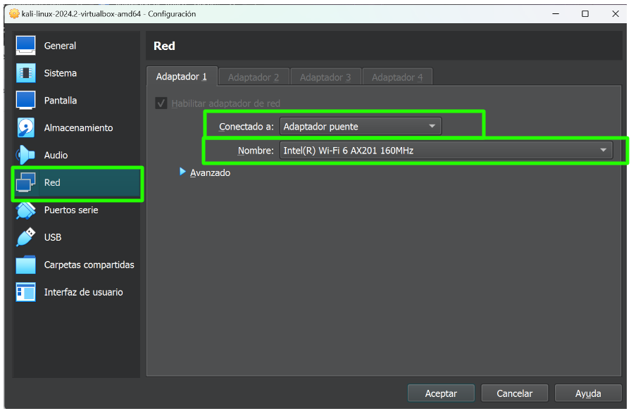

# Traffic simulation on the wordpress site

This project seeks to generate artificial traffic from a Kali Linux machine to a website hosted on a Debian server using the Apache Benchmark (ab) tool. Additionally, monitoring tools will be implemented on the server to detect traffic surges and evaluate its performance.

<!-- hide -->

> By [@rosinni](https://github.com/rosinni) and [other contributors](https://github.com/4GeeksAcademy/deploying-wordpress-debian/graphs/contributors) at [4Geeks Academy](https://4geeksacademy.co/)

*These instructions are [available in english](https://github.com/4GeeksAcademy/deploying-wordpress-debian/blob/main/README.md)*
<!-- endhide -->

<!-- hide -->
### Before you start...

> We need you! These exercises are built and maintained in collaboration with contributors such as yourself. If you find any bugs or misspellings please contribute and/or report them.
<!-- endhide -->

<!-- hide -->

## 🌱 How to start a project?

### Local Installation:
Clone the repository to your local environment [repository](https://github.com/breatheco-de/traffic-simulation-on-wordpress) and follow the instructions in the README file.

### Requirements

To carry out this project, we will need 2 virtual machines. One will be the Debian virtual machine where we previously built the WordPress website, and the other will be the Kali virtual machine as the attacker.

* Oracle VirtualBox
* Virtual machine with Kali Linux (Attacker): To generate traffic.
* Virtual machine with Debian (Web Server): Where we have the Apache server and the WordPress site hosted.

## 📝 Instructions

### Step 1: Configure the Network in VirtualBox

#### Configure the Network of the Debian Machine (Web Server):
* Open VirtualBox.
* Select your Debian virtual machine and click on "Settings".
* Go to the "Network" section.
* Ensure that "Adapter 1" is enabled and set to "Bridged Adapter".
* En el campo "Nombre", selecciona el adaptador de red física que deseas usar (el que tu host está utilizando para conectarse a la red, como Wi-Fi o Ethernet). Esto suele ser algo como "Intel(R) Ethernet Connection" o "Wi-Fi".
* Save the changes and close the settings window.

#### Configure the Network of the Kali Linux Machine (Attacker):
* Select your Kali Linux virtual machine and click on "Settings".
* Go to the "Network" section.
* Ensure that "Adapter 1" is enabled and set to "Bridged Adapter".
* In the "Name" field, select the same physical network adapter you selected for the Debian machine.
* Save the changes and close the settings window.

.

<!-- hide -->
## Contributors

Thanks goes to these wonderful people ([emoji key](https://github.com/kentcdodds/all-contributors#emoji-key)):

1. [Rosinni Rodríguez (rosinni)](https://github.com/rosinni) contribution: (build-tutorial) ✅, (documentation) 📖
  
2. [Alejandro Sanchez (alesanchezr)](https://github.com/alesanchezr),  contribution: (bug reports) 🐛

3. [Lorena Gubaira (lorenagubaira)](https://github.com/lorenagubaira), contribution: (bug reports) 🐛, contribution: (editor), (translation) 🌎

This project follows the [all-contributors](https://github.com/kentcdodds/all-contributors) specification. Contributions of any kind are welcome!

This and many other exercises are built by students as part of the 4Geeks Academy [Coding Bootcamp](https://4geeksacademy.com/us/coding-bootcamp) by [Alejandro Sánchez](https://twitter.com/alesanchezr) and many other contributors. Find out more about our [Full Stack Developer Course](https://4geeksacademy.com/us/coding-bootcamps/part-time-full-stack-developer), and  [Data Science Bootcamp](https://4geeksacademy.com/us/coding-bootcamps/datascience-machine-learning).You can alse deepdive in the world of cybersecurity with our [Cybersecurity Bootcamp](https://4geeksacademy.com/us/coding-bootcamps/cybersecurity)
<!-- endhide -->